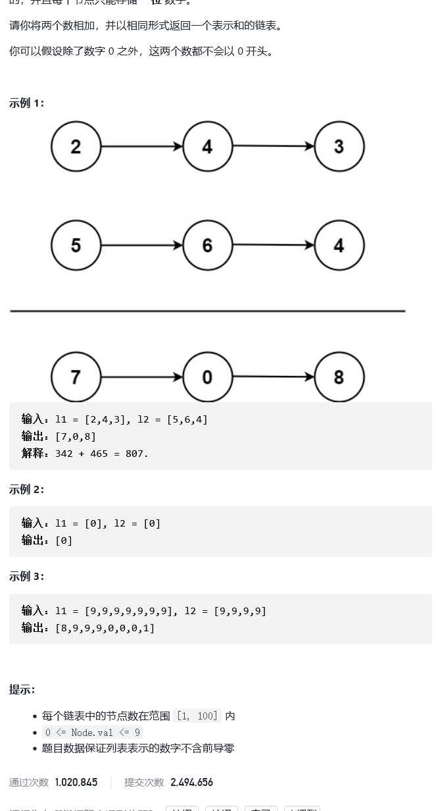

# 2.两数相加



题目——[链接](https://leetcode-cn.com/problems/add-two-numbers/)

```C++
class Solution {
public:
    ListNode* addTwoNumbers(ListNode* l1, ListNode* l2) {
        /*
            从前往后遍历链表，对应的结点乘以10的n次方
            越高位越往后存，所以用尾插           
        */
        //其中一个为空直接返回另一个
        if(!l1)
        {
            return l2;
        }
        if(!l2)
        {
            return l1;
        }
        //初始化一个头结点(不存数据，最后将这个结点去掉了(return它的next))
        ListNode* sumNode = new ListNode;
        sumNode->next = NULL;
        //用于尾插链接,保存定位当前链表的最后一个结点
        ListNode* tempnode = NULL;
        int n = 0;//负责进一

        //循环进入条件，如果1个不为空或者有1可进
        while(l1 || l2 || n == 1)
        {     
            //为每一位相加的结果创建新结点
            ListNode* addNode = new ListNode;
            
            //如果l1和l2一样长，但是最后两个数相加能进一
            if(!l1 && !l2)
            {
                addNode->val = n;
                tempnode->next = addNode;
                addNode->next = NULL;
                break;
            }
            //如果l2已经到头，但是l2没有
            else if(!l2)
            {
                addNode->val = l1->val+n;
                if(addNode->val >= 10)
                {
                    n = 1;
                    addNode->val %= 10;
                }
                else
                {
                    n = 0;
                }
                tempnode->next = addNode;
                addNode->next = NULL;
                tempnode = addNode;
            }
            //如果l1已经到头，但是l2没有
            else if(!l1)
            {
                addNode->val = l2->val+n;
                if(addNode->val >= 10)
                {
                    n = 1;
                    addNode->val %= 10;
                }
                else
                {
                    n = 0;
                }
                tempnode->next = addNode;
                addNode->next = NULL;
                tempnode = addNode;
            }
            else//两个都不为空
            {
                   addNode->val = l1->val + l2->val + n;
                   n  =  0;
                   if(addNode->val >= 10)
                   {
                       n = 1;
                       addNode->val %= 10;
                   }
            }
         
            
            //根据题目结果来看，最后的和是通过尾插法插入到sumNode中的

            //如果是第一次插入
            if(!sumNode->next)
            {
                sumNode->next = addNode;
                addNode->next = NULL;
                //用于保存当前最后一个结点
                tempnode = addNode;
            }
            else
            {
               //用于保存之前头结点后面的结点
                tempnode->next = addNode;
                addNode->next = NULL;
                tempnode = addNode;
            }


            //判断条件，什么时候可以往后指
            if(l1)
            {
                   l1 = l1->next;
            }
            if(l2)
            {
                   l2 = l2->next;
            }
           
        }

        //去掉第一个结点(直接返回sumNode->Next从第二个开始有数据的结点开始返回好像也行)
        // ListNode* deleHead = sumNode->next;
        // sumNode->val = sumNode->next->val;
        // sumNode->next = sumNode->next->next;
        // delete deleHead;
        return sumNode->next;
    }
};
```