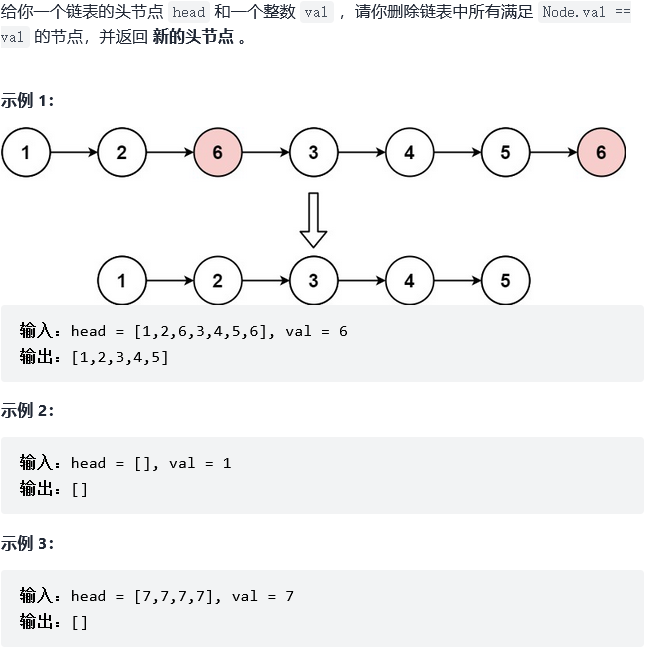

# 203.移除链表元素

链接——[链接](https://leetcode-cn.com/problems/remove-linked-list-elements/)



```C++
class Solution {
public:
    ListNode* removeElements(ListNode* head, int val) {
        if(!head)
        {
            return head;
        }
        //设置一个新的头结点指向head——就能解决
        ListNode* Newhead = new ListNode;
        Newhead->next = head;
        ListNode* tempnode = Newhead;

        while(tempnode->next)
        {
            if(tempnode->next->val == val)
            {
                ListNode* recv = tempnode->next;
                tempnode->next= tempnode->next->next;
                delete recv;  
            }
            else
            {
                tempnode = tempnode->next;
            }              
        }

        ListNode* temp = Newhead->next;
        delete Newhead;
        return temp;
    }
};
```

