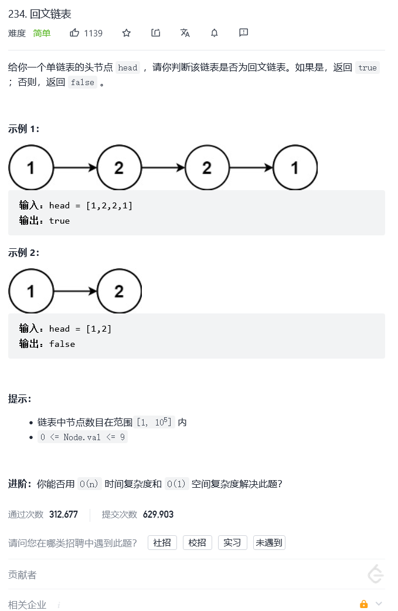

# 234.回文链表

题目——[链接](https://leetcode-cn.com/problems/palindrome-linked-list/)



```C++
class Solution {
public:
    bool isPalindrome(ListNode* head) {
        //用容器装，然后从头到后遍历比较
        //注意容器存储类型,存val内存开销会小一点
        vector<int>ListV;
        while(head)
        {
            ListV.push_back(head->val);
            head = head->next;
        }
        for(int i = 0,j= ListV.size()-1;i<j;i++,j--)
        {
                if(ListV[i]!= ListV[j])
                {
                    return false;
                }
        }
        return true;
    }
};
```

