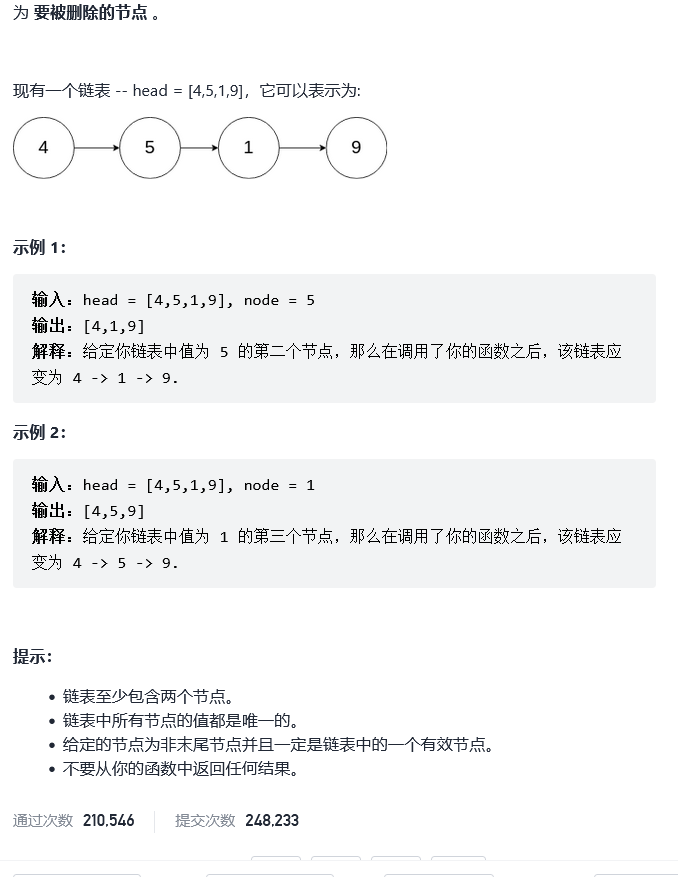

# 237.删除链表中的结点

题目——[链接](https://leetcode-cn.com/problems/delete-node-in-a-linked-list/)



```C++
//将变成后面的结点，然后将后面的结点删除防止内存泄漏
class Solution {
public:
    void deleteNode(ListNode* node) {
     ListNode* tempnode = node->next;
     node->val = tempnode->val;
     node->next = tempnode->next;
     delete tempnode;
    }
};
```

