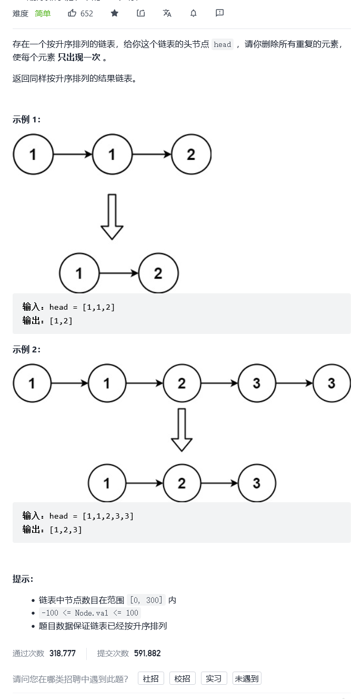

# 83. 删除排序链表中的重复元素

***

题目——[链接](https://leetcode-cn.com/problems/remove-duplicates-from-sorted-list/)



***

## 单指针法

```C++
//一个指针往后遍历
class Solution {
public:
    ListNode* deleteDuplicates(ListNode* head) {
        if(!head || !head->next)
        {
            return head;
        }
        ListNode* tempnode = head;//这个头结点里面好像有元素
        while(tempnode->next)
        {
            if(tempnode->val == tempnode->next->val)
            {
                tempnode->next = tempnode->next->next;
            }
            else
            {
                tempnode = tempnode->next;
            }
        }
        return head;
    }
};
```

## 双指针-前后指针法

**注意前后指针的链接**

```C++
class Solution {
public:
    ListNode* deleteDuplicates(ListNode* head) {
        if(!head || !head->next)
        {
            return head;
        }
        ListNode* Prev = head;
        ListNode* Next = head->next;

        while(Next)
        {
            if(Prev->val == Next->val)
            {
              
               Prev->next = Next->next;
               Next = Next->next;               
            }
            else
            {
                Prev= Next;
                Next = Next->next;
            }
        }
        return head;
    }
};
```

## 递归法

感谢这位老哥的分享——[链接](https://leetcode-cn.com/problems/remove-duplicates-from-sorted-list/comments/40973)

```C++
class Solution {
public:
    ListNode* deleteDuplicates(ListNode* head) {
        if(!head || !head->next)
        {
            return head;
        }
        head->next = deleteDuplicates(head->next);
        if(head->val == head->next->val)
        {
            head = head->next;
        }
        
        return head;
    }
};
```

**图解**:


