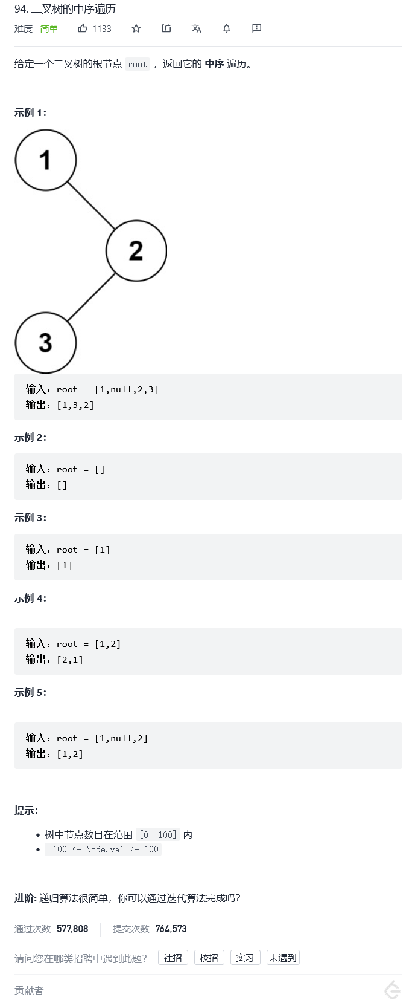

# 94.二叉树的中序遍历

[题目](https://leetcode-cn.com/problems/binary-tree-inorder-traversal/)



[感谢这位老哥分享](https://leetcode-cn.com/problems/binary-tree-inorder-traversal/solution/zhan-c-by-li-kou-it-16d5/)

```C++
class Solution {
public:
    //中序遍历顺序-左-中-右
    vector<int> inorderTraversal(TreeNode* root) {
        vector<int>recv;
        stack<TreeNode*> Tstack;
       
       //当前结点不为空或当前栈不为空
       while(root || !Tstack.empty())
       {
           while(root)
           {
               //只要当前结点不为空就往栈里面压
               Tstack.push(root);
               root = root->left;
           }
           //此时栈顶元素为根节点左侧树最左的左子树
           //取到该结点
           root = Tstack.top();
           Tstack.pop();
           //pop出栈，存进recv中
           recv.push_back(root->val);
           root = root->right;
       }
        return recv;
    }
};
```


